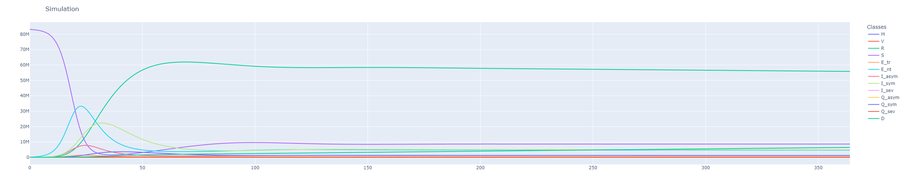

# MVSEIQRD Model

*Maternity-derived Immunity - Vaccinated - Susceptible - Exposed - Infectious - Quarantined - Recovered - Dead*

An extended SEIR model.

    

## Basic Overview

A simulation of the coronavirus pandemic in Germany based on the SEIR model. 

## :date: Timeframe for the project

The project takes place between December 2021 and March 2022.

## :wrench: Usage

Tweak hyperparameters to review different scenarios on the Dashboard. See MVSEIQRD_Modell.ipynb.

## :boy: Authors

**Tobias Becher**  
**Maximilian Fischer** 
**Artur Safenreiter** 

## :pray: Acknowledgments

This project was part of the course "Scientific Programming in Python" at University of Hagen. 
The data is taken from [Robert Koch Institut](https://github.com/robert-koch-institut).

## 📝 License

Copyright © 2021 [Tobias Becher](https://github.com/TB-DevAcc).  
This project is [MIT](https://github.com/TB-DevAcc/SEIQRS/blob/master/LICENSE) licensed.
